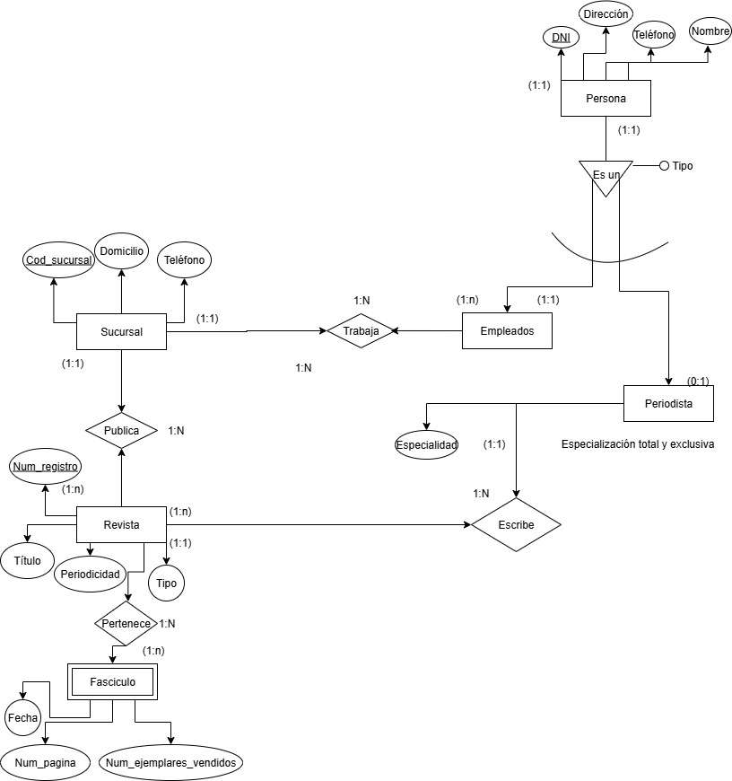
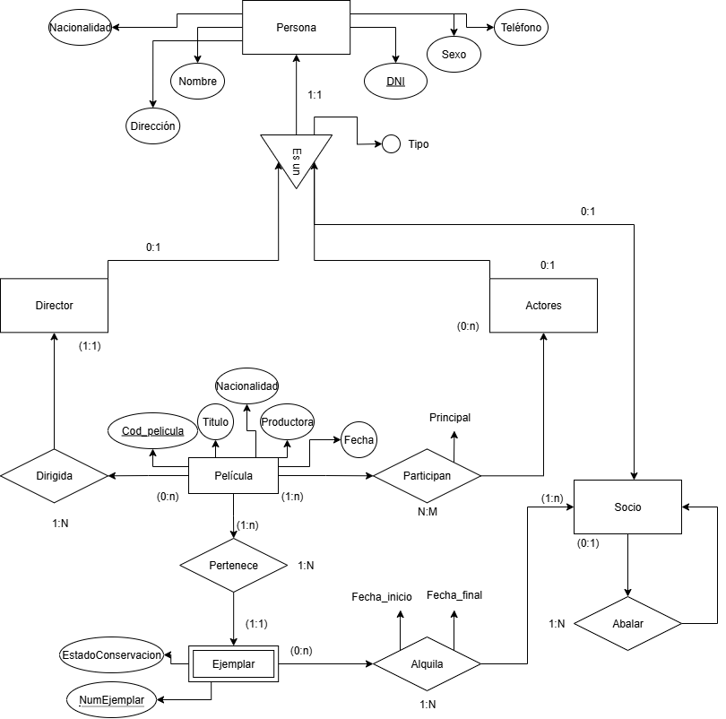
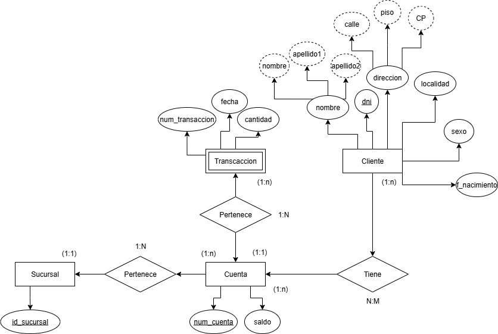
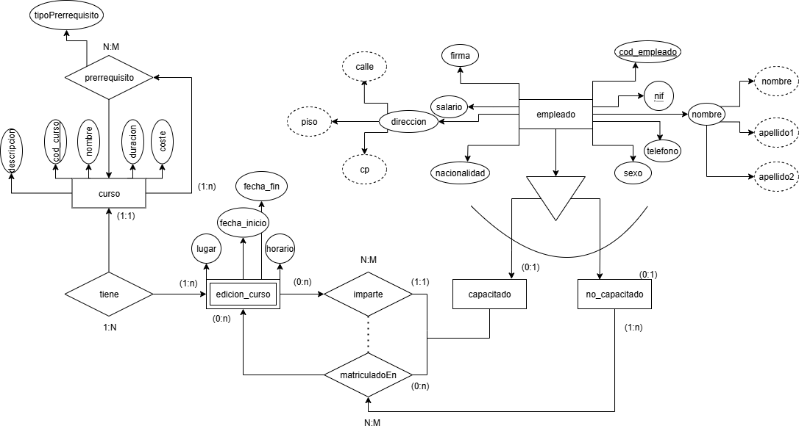
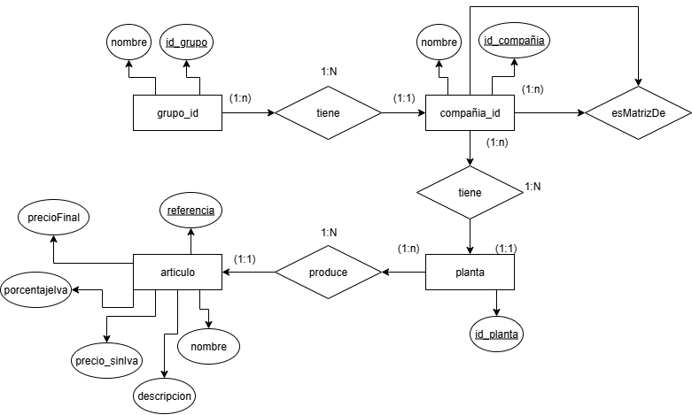

# Ejercicio 8 Escuela

- ALUMNO (Núm_Matrícula, Nombre, FechaNacimiento, Teléfono).
- ASIGNATURA (Código_asignatura, Nombre).
- PROFESOR (Id_P, NIF_P, Nombre, Especialidad, Teléfono).
 
## Teniendo en cuenta: 
- Un alumno puede estar matriculado de una o varias asignaturas. 
Además puede estar matriculado en la misma asignatura más de un curso escolar (si repite). 
Se quiere saber el curso escolar en el que cada alumno está matriculado de cada asignatura. 
- Una asignatura es impartida por un único profesor. ● Un profesor podrá impartir varias asignaturas. 
 

# Ejercicio 9. Empleados y su lugar de nacimiento. Obtén el diagrama E/R. 
- REGION ( CodRegion, Nombre)
- PROVINCIA (CodProvincia, Nombre)
- LOCALIDAD (CodLocalidad, Nombre)
- EMPLEADO (ID, DNI, Nombre, FechaNac, Telefono, Salario) 
Se quiere guardar información de la localidad donde ha nacido cada uno de los empleados teniendo en cuenta que:
- Un empleado ha nacido en una sola localidad.
- Cada localidad pertenece a una única provincia.
- Cada provincia pertenece a una única región del país. 

# Ejercicio 11. Empresa de montaje de dormitorios. Obtén el diagrama E/R. 
Una empresa dedicada a la instalación de dormitorios juveniles a medida quiere realizar una base de datos donde se reflejen las ventas y montajes, para lo cual se tiene en cuenta: 
- Cada modelo de dormitorio lo debe montar, al menos, dos montadores.
- El mismo montador puede montar varios modelos de dormitorios.
- De cada modelo dormitorio nos interesa conocer su código de modelo.
- El mismo montador puede montar el mismo modelo en diferentes fechas. Nos interesa conocer la fecha en la que realiza cada montaje.
- De un montador nos interesa su NIF, nombre, dirección, teléfono de contacto y el número de dormitorios que ha montado de cada modelo.
- Cada modelo de dormitorio puede ser comprado por uno o varios clientes y el mismo cliente podrá comprar uno o varios dormitorios. De un cliente nos interesa su NIF, nombre, dirección, teléfono y fecha de compra de cada modelo. 

# Ejercicio 12. Alquiler de automóviles. Obtén el diagrama E/R. 
●	Un determinado cliente puede tener en un momento dado hechas varias reservas. 
●	De cada cliente se desea almacenar su DNI, nombre, dirección y teléfono. 
Además dos clientes se diferencian por un único código. 
 
De cada reserva es importante registrar su número de identificación, la fecha de inicio y final de la reserva, el precio total. 
- De cada coche se requiere la matrícula, el modelo, el color y la marca. Cada coche tiene un precio de alquiler por hora.
- Además en una reserva se pueden incluir varios coches de alquiler. Queremos saber los coches que incluye cada reserva y los litros de gasolina en el depósito en el momento de realizar la reserva, pues se cobrarán aparte.
- Cada cliente puede ser avalado por otro cliente de la empresa. 

# Ejercicio 13 Editorial. Obtén el diagrama E/R. 
- La editorial tiene varias sucursales, con su domicilio, teléfono y un código de sucursal. 
- Cada sucursal tiene varios empleados, de los cuales tendremos sus datos personales, DNI y teléfono. Un empleado trabaja en una única sucursal.
- En cada sucursal se publican varias revistas, de las que almacenaremos su título, número de registro, periodicidad y tipo.
- La editorial tiene periodistas (que no trabajan en las sucursales) que pueden escribir fascículos para varias revistas. Almacenaremos los mismos datos que para los empleados, añadiendo su especialidad.
- Para cada revista, puede tener varios fascículos (entregas). Ejemplo: La revista Egiptología puede tener los fascículos 1,2,3… De cada fascículo, tendremos su número, que será único para cada revista, pero que puede coincidir con otras revistas. También se incluirá la fecha, número de páginas y el número de ejemplares vendidos. 

# Ejercicio 14 Video-Clubs Glob-Gusters .Obtén el diagrama E/R. 
 
- Una película se caracteriza por su título, nacionalidad, productora y fecha. Puede haber varias películas con el mismo título pero rodadas en fechas distintas. Utilizaremos como clave primaria un id autonumérico para evitar problemas con el título.
- En una película pueden participar varios actores (nombre, nacionalidad, sexo) algunos de ellos como actores principales.
- Una película está dirigida por un director (nombre, nacionalidad).
- De cada película dispone de uno o varios ejemplares diferenciados por un número de ejemplar (único por película, pero puede haber repetidos en distintas películas) y caracterizados por su estado de conservación.
- Un ejemplar se puede encontrar alquilado a algún socio (DNI, nombre, dirección, teléfono) . Se desea almacenar la fecha de comienzo del alquiler y la de devolución.
- Un socio tiene que ser avalado por otro socio que responda de él en caso de tener problemas en el alquiler. 

# Ejercicio 16. Banco Sant-Ander. Obtén el diagrama E/R. 

Construir el Modelo E/R teniendo en cuenta las siguientes restricciones: 
- Una transacción viene determinada por un número de transacción (único para cada cuenta), la fecha y la cantidad.
- Un cliente puede tener muchas cuentas. Queremos almacenar su nombre, dni, dirección, localidad, fecha de nacimiento y sexo.
- Una cuenta puede ser de muchos clientes. Tendrá un número de cuenta único para una sucursal y un saldo.
- Una cuenta sólo puede estar en una sucursal.
- De la sucursal solo nos interesa conocer su número identificativo. 

# Ejercicio 19. El departamento de formación. Realiza el modelo E/R extendido 

La empresa organiza cursos internos de formación de los que se desea conocer el código de curso, el nombre, una descripción, el número de horas de duración y el coste del curso. 

Un curso puede tener como prerrequisito haber realizado otro u otros previamente, y a su vez, la realización de un curso puede ser prerrequisito de otros. Un curso que es un prerrequisito de otro puede serlo de forma obligatoria o sólo recomendable. 

Un mismo curso tiene diferentes ediciones, es decir, se imparte en diferentes lugares, fechas y con diferentes horarios (intensivo, de mañana o de tarde). En una misma fecha de inicio sólo puede impartirse una edición de un mismo curso. 

Los cursos se imparten por personal de la propia empresa. 

De los empleados se desea almacenar su código de empleado, nombre y apellidos, dirección, teléfono, NIF (Número de Identificación Fiscal), fecha de nacimiento, nacionalidad, sexo, firma y salario, así como si está o no capacitado para impartir cursos. 

# Ejercicio 22.Grupo empresarial. Realiza el modelo E/R 
- Un grupo (Group-ID) tiene varias compañías (Comp-ID), mientras que una compañía pertenece a un grupo.
- Tanto de los grupos como de las compañías nos interesa guardar el nombre
- Las compañías están conectadas por una estructura jerárquica; cada filial está asignada exactamente a una compañía del siguiente nivel jerárquico superior: la compañía matriz.
- Cada compañía tiene varias plantas (ID de Planta); una planta pertenece a una sola empresa.
- Una planta produce muchos artículos (Artículos). Un artículo sólo se produce en una de las plantas.
- Del artículo (Referencia) guardaremos guardar el nombre, descripción, precio sin iva, %iva y precio final 

