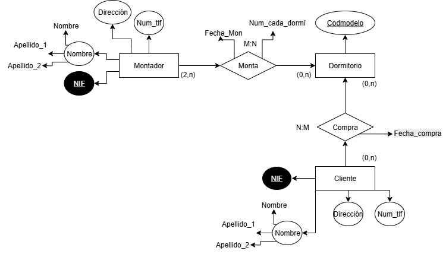
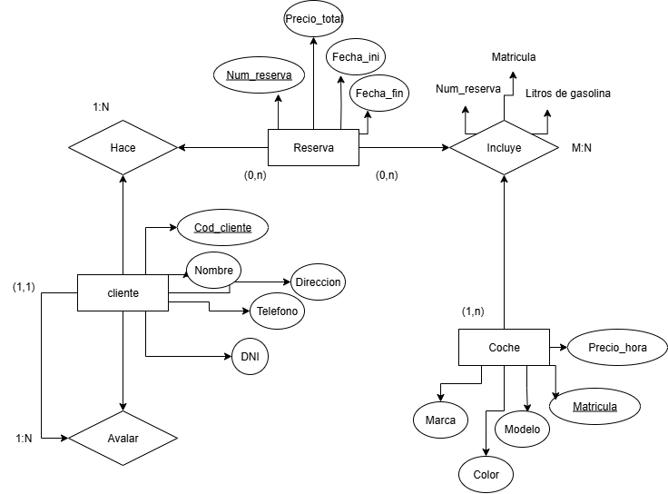

# Ejercicio 8 Escuela

- ALUMNO (Núm_Matrícula, Nombre, FechaNacimiento, Teléfono).
- ASIGNATURA (Código_asignatura, Nombre).
- PROFESOR (Id_P, NIF_P, Nombre, Especialidad, Teléfono).
 
## Teniendo en cuenta: 
- Un alumno puede estar matriculado de una o varias asignaturas. 
Además puede estar matriculado en la misma asignatura más de un curso escolar (si repite). 
Se quiere saber el curso escolar en el que cada alumno está matriculado de cada asignatura. 
- Una asignatura es impartida por un único profesor. ● Un profesor podrá impartir varias asignaturas. 
 

# Ejercicio 9. Empleados y su lugar de nacimiento. Obtén el diagrama E/R. 
- REGION ( CodRegion, Nombre)
- PROVINCIA (CodProvincia, Nombre)
- LOCALIDAD (CodLocalidad, Nombre)
- EMPLEADO (ID, DNI, Nombre, FechaNac, Telefono, Salario) 
Se quiere guardar información de la localidad donde ha nacido cada uno de los empleados teniendo en cuenta que:
- Un empleado ha nacido en una sola localidad.
- Cada localidad pertenece a una única provincia.
- Cada provincia pertenece a una única región del país. 

# 11. Empresa de montaje de dormitorios. Obtén el diagrama E/R. 
Una empresa dedicada a la instalación de dormitorios juveniles a medida quiere realizar una base de datos donde se reflejen las ventas y montajes, para lo cual se tiene en cuenta: 
- Cada modelo de dormitorio lo debe montar, al menos, dos montadores.
- El mismo montador puede montar varios modelos de dormitorios.
- De cada modelo dormitorio nos interesa conocer su código de modelo.
- El mismo montador puede montar el mismo modelo en diferentes fechas. Nos interesa conocer la fecha en la que realiza cada montaje.
- De un montador nos interesa su NIF, nombre, dirección, teléfono de contacto y el número de dormitorios que ha montado de cada modelo.
- Cada modelo de dormitorio puede ser comprado por uno o varios clientes y el mismo cliente podrá comprar uno o varios dormitorios. De un cliente nos interesa su NIF, nombre, dirección, teléfono y fecha de compra de cada modelo. 

# 12. Alquiler de automóviles. Obtén el diagrama E/R. 
●	Un determinado cliente puede tener en un momento dado hechas varias reservas. 
●	De cada cliente se desea almacenar su DNI, nombre, dirección y teléfono. 
Además dos clientes se diferencian por un único código. 
 
De cada reserva es importante registrar su número de identificación, la fecha de inicio y final de la reserva, el precio total. 
- De cada coche se requiere la matrícula, el modelo, el color y la marca. Cada coche tiene un precio de alquiler por hora.
- Además en una reserva se pueden incluir varios coches de alquiler. Queremos saber los coches que incluye cada reserva y los litros de gasolina en el depósito en el momento de realizar la reserva, pues se cobrarán aparte.
- Cada cliente puede ser avalado por otro cliente de la empresa. 

